[English](./README.en.md) · [Website](https://agentguard-ts.lei6393.com) · [GitHub](https://github.com/SuperMarioYL/agentguard-ts)

<picture>
  <source media="(max-width: 600px) and (prefers-color-scheme: dark)" srcset="./assets/presentation/hero-mobile-dark.svg">
  <source media="(max-width: 600px)" srcset="./assets/presentation/hero-mobile-light.svg">
  <source media="(prefers-color-scheme: dark)" srcset="./assets/presentation/hero-dark.svg">
  
</picture>

# agentguard-ts

**在 Agent 阅读的文件中找出可疑指令。**

AgentGuard 扫描本地项目与依赖文本，提取 prose 单元，并应用明确指令模式规则。

## 为什么需要它

注释、文档和 fixture 可能含有面向助手的文本。保留来源类型与位置的扫描可以让检查者定位具体句子。

- **定位具体文本** — 结果保留源文件和行号。
- **检查命中原因** — 规则解释展示触发模式。
- **控制 CI 行为** — 级别和配置规则共同决定退出状态。

## 架构

<picture>
  <source media="(max-width: 600px) and (prefers-color-scheme: dark)" srcset="./assets/presentation/architecture-mobile-dark.svg">
  <source media="(max-width: 600px)" srcset="./assets/presentation/architecture-mobile-light.svg">
  <source media="(prefers-color-scheme: dark)" srcset="./assets/presentation/architecture-dark.svg">
  
</picture>

walk 枚举文件，extract 提取注释、Markdown、YAML 与支持的工具描述，rules 组合可疑动词和收件人模式。scanner 应用项目覆盖设置，report 按级别汇总；HIGH 发现设置非零扫描状态。

| 组件 | 职责 |
| --- | --- |
| `File walk` | src/walk.ts |
| `Prose extraction` | src/extract.ts |
| `Pattern rules` | src/rules.ts |
| `Findings / report` | src/scanner.ts; report.ts |

## 安装与快速上手

使用仓库清单指定的运行时版本构建，并在仓库根目录运行示例。

```bash
git clone https://github.com/SuperMarioYL/agentguard-ts.git
cd agentguard-ts
npm ci
npm run build
```

创建含一条可疑句子与普通文档的完整临时 README，运行生产扫描链路。

```bash
node examples/presentation-demo.mjs
```

## 实际运行示例

<picture>
  <source media="(max-width: 600px) and (prefers-color-scheme: dark)" srcset="./assets/presentation/process-mobile-dark.svg">
  <source media="(max-width: 600px)" srcset="./assets/presentation/process-mobile-light.svg">
  <source media="(prefers-color-scheme: dark)" srcset="./assets/presentation/process-dark.svg">
  
</picture>

The scanner reports a HIGH destructive.delete finding at the synthetic README’s second line.

```text
{
  "files": 1,
  "units": 3,
  "findings": [
    {
      "file": "README.md",
      "line": 2,
      "rule": "destructive.delete",
      "severity": "HIGH"
    }
  ],
  "scan_exit": 1
}
```

完整命令与输出保存在 [docs/demo-results.json](./docs/demo-results.json). 输入和复现代码均随仓提供。


保留已有录制供参考；上方文字示例给出当前可复现的操作。

## 用法

CLI 提供以下操作。示例之外的命令需要替换成你的文件路径或标识。

```bash
node dist/cli.js scan . --no-deps
node dist/cli.js scan . --json
node dist/cli.js scan . --ci
```

## 配置

CLI 默认扫描项目与依赖，--no-deps 排除依赖。.agentguard.yaml 可禁用规则或覆盖级别。显式 --config 路径必须可读且有效，--rules 可指定其他签名文件。

## 集成与职责分工

<picture>
  <source media="(max-width: 600px) and (prefers-color-scheme: dark)" srcset="./assets/presentation/integrations-mobile-dark.svg">
  <source media="(max-width: 600px)" srcset="./assets/presentation/integrations-mobile-light.svg">
  <source media="(prefers-color-scheme: dark)" srcset="./assets/presentation/integrations-dark.svg">
  
</picture>

以下路径已有源码实现。按任务选择输入，并把生成的结果与项目一起保存。

| 路径 | 已实现职责 |
| --- | --- |
| Local source / node_modules | File scan input |
| Typed prose units | Comments, Markdown and YAML |
| Rule YAML | Instruction signatures |
| Project config | Rule disable and severity overrides |

## 限制与后续方向

- 这是启发式文本检测，不证明包恶意，也不证明无发现包安全。
- 修改规则级别会改变 CI 结果；解释无发现状态时应检查项目覆盖设置。
- 示例扫描一份合成 README，不执行其中可疑句子。

更多语言提取与规则精度改进应基于具体漏检载荷和正常文本误报。

## 许可与贡献

许可见 [LICENSE](./LICENSE). 反馈问题时请提供最小输入、执行命令和实际输出。
